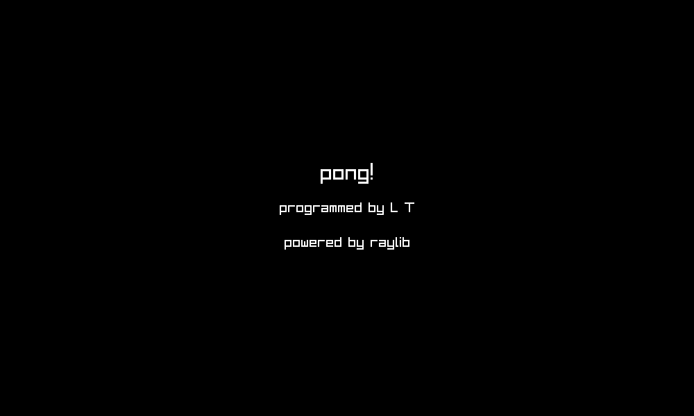

## pong

### Description

Recreation of the Atari classic "Pong", with single-player and shared-screen modes.

### Controls

To move up and down:

- Player 1: Up and Down (also Q and A, respectively)

- Player 2: P and L

### Screenshots

### Developers

- Luis Torres

### License

This project sources are licensed under an unmodified zlib/libpng license,
which is an OSI-certified, BSD-like license that allows static linking with
closed source software. Check [LICENSE](LICENSE) for further details.

*Copyright (c) 2024  (lmtorresv)*
