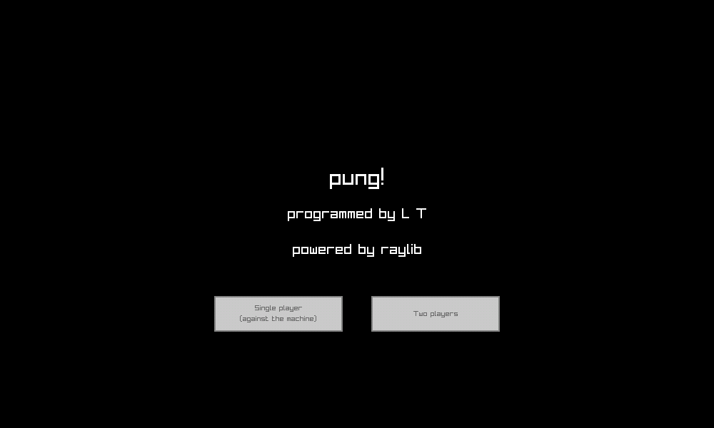

# pong

## Description

Recreation of the Atari classic, with single-player and shared-screen modes.

## Controls

To move up and down:

- Player 1: Up and Down (also Q and A, respectively)

- Player 2: P and L

## Screenshots



## Build

## Prerequisites

- A C99 compatible compiler

- CMake >= 3.24

### CMake

- Desktop:

    ```bash
    mkdir build
    cd build
    cmake ..
    make
    cd pong  # Make sure resources can be found (relies on relative path).
    ```

- Web:

    Compiling for the web requires the [Emscripten
    SDK](https://emscripten.org/docs/getting_started/downloads.html):

    ``` bash
    mkdir build
    cd build

    # Configure CMake
    emcmake cmake .. -DPLATFORM=Web -DCMAKE_BUILD_TYPE=Release -DCMAKE_EXECUTABLE_SUFFIX=".html"

    # Build the HTML/JS/WASM
    emmake make

    # Serve the website
    emrun pong/pong.html
    ```

    If you're using Windows, add `-G "MinGW Makefiles"` if you want to use
    mingw instead of Visual Studio.

    Also, Microsoft's C/C++ compiler might not be able to compile it because of
    its lack of support for variable-length arrays. It happened to me on
    another project. Had to use `clang`.

## Developers

- Luis Torres

## License

This project sources are licensed under an unmodified zlib/libpng license,
which is an OSI-certified, BSD-like license that allows static linking with
closed source software. Check [LICENSE](LICENSE) for further details.

*Copyright (c) 2024  (luismtorresv)*
